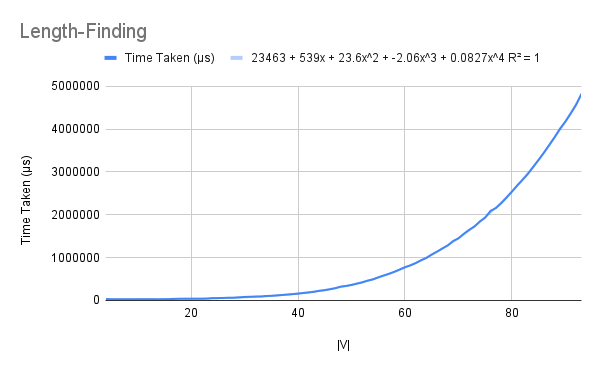
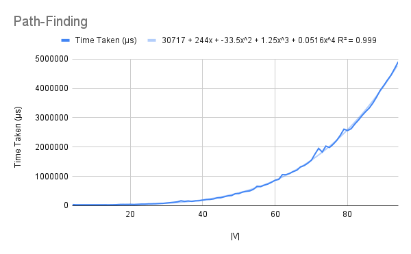
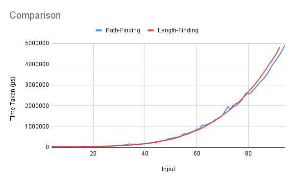

# All Pairs Shortest Path
To compute the shortest path between any two nodes, the Floyd-Warshall algorithm was taught in class. It has been implemented in two ways – one that only finds the lengths of the paths, and one that finds the paths themselves as well.

## Running
To run one of the algorithms, uncomment (remove the two hyphens and the space preceding) the corresponding line in the `main` function, save the file, and recompile. When running, pass the graph (pair of list of vertices and list of edges, which are pairs of source-destination pairs and weights), enclosed in quotes, as a command-line argument.
```
> ./allpairs "([0,1,2,3,4], [((0,1),3), ((0,2),8), ((0,4),-4), ((1,3),1), ((1,4),7), ((2,1),4), ((3,2),-5), ((3,0),2), ((4,3),6)])"
[[0.0,1.0,-3.0,2.0,-4.0],[3.0,0.0,-4.0,1.0,-1.0],[7.0,4.0,0.0,5.0,3.0],[2.0,-1.0,-5.0,0.0,-2.0],[8.0,5.0,1.0,6.0,0.0]]
```

## Explanation
### Length-Finding
This function, like those of most previously studied algorithms, has a wrapper `lengths` that finds accesses the last element of each cell in the table created by `lengths'`.  

The `lengths'` function, as taught in class, iterates over all pairs of nodes `i` and `j`, and computes the shortest path between them using nodes `[0..k]` for all `k`.  
If `i` and `j` are the same node, the path length is zero for all `k` (assuming no negative-weight cycles). If not, the case for `k=0` is given by checking for the smaller path between the single edge between `i` and `j` (if any) and a path with node 0 as an intermediate (if any). All other `k` use the recursion.  

`lookup'` is a modification of the default `lookup` function. If the edge is not present, instead of returning the special value `Nothing`, it returns infinity (`(1/0)`).

### Path-Finding
This code is just like the length-finding case, except that (1) the cells of the table are compared by their first element (the length of the path), using the function `minByF`, and (2) the paths are combined using `join`, which adds the lengths and concatenates the paths.  

Again, `lookup'` is a modification of the default `lookup` function. If the edge is not present, instead of returning the special value `Nothing`, it returns infinity (`(1/0)`) *as the path length*; the path itself is either an empty list or a singleton list consisting of the edge.

## Analysis
Both functions were run on complete graphs with |V| ranging from 4 to 94.  

The R² values of the best fit of various types of functions for each of the algorithms' running times are shown below.  

Algorithm      | Linear | Quadratic | Cubic | Biquadratic | Quintic | Exponential | Power Series | Logarithmic  
-------------- | ------ | --------- | ----- | ----------- | ------- | ----------- | ------------ | -----------  
Length-Finding | 0.63   | 0.893     | 0.961 | 0.982       | 0.111   | 0.978       | 0.796        | 0.344  
Path-Finding   | 0.758  | 0.977     | 0.995 | 0.995       | 0.111   | 0.985       | 0.798        | 0.427  

### Length-Finding
A theoretical consideration of the runtime parallels the analysis of the algorithm itself for the most part, except for the base cases. For each vertex `i`, the code iterates over all vertices `j`; if `i` and `j` are the same, a list of zeroes is generated, and otherwise, the actual distances have to be found. Thus the time is proportional to |V|(|V| + |V|(T)).  
To find T, note that for vertex 0, `lookup'` is called on `es` thrice, adding |E| to the time. Then, for each remaining vertex `k`, `(!!)` is used 9 times, adding |V| to the time.  

Finally, `lengths` calls `last` on each cell of the table. Thus we have O(|V|(|V| + |V|(|E| + |V|) + |V|(|V|))). Since |E| = O(|V|²), this reduces to being biquadratic in |V|. The high R² value of this curve is further evidence in favour of this.  

  

### Path-Finding
The theoretical analysis of this code is exactly as in the case of length-finding, except for the added complication of `join`. The modified time would be proportional to |V|(|V| + |V|(|E| + T(`join`) + |V|(|V| + T(`join`)))), which is equivalent to |V|⁴ + |V|³T(`join`) for big-O time.  

Note that `join` uses the concatenation operator `(++)`, which is linear in the length of its first operand. The length of the first operand is difficult to predict, though, as it depends on the paths being joined. It could be anything between constant or |E|; if the former, the running time remains biquadratic, but if the latter, it increases to the fifth power. The R² value is equal for both these curves.  

However, note that the sample space consists of complete directed graphs. This means that there is a single-edge path between any two given nodes; these paths will occupy the whole table constructed by `paths'`. Thus, `join` takes constant time and we predict that the function to run in biquadratic time.  

  

## Comparison
Remarkably, the two functions take nearly equal time throughout the sample space. Since the only extra factors are introduced by calls to `join` and `fst`, and we have already seen that `join` takes constant time, we conclude that they both also take a negligible amount of time compared to the range we are considering (50,000 to 50,00,000 μs).  

  

