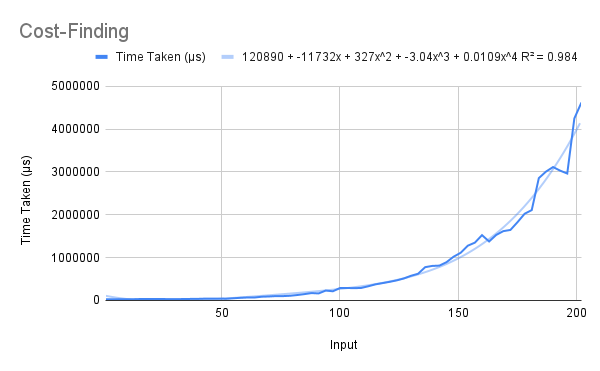
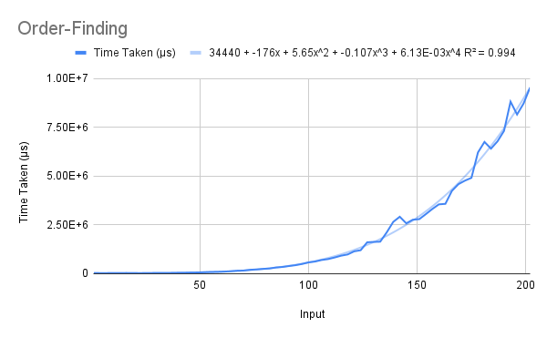
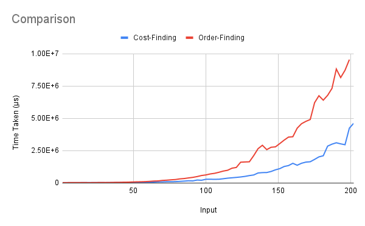

# Chain Matrix Multiplication
One dynamic programming algorithm was taught in class to find the most efficient way to multiply *n* matrices. There are two variations in the code – one simply finds the cost of (number of single-integer multiplications invovled in) the minimum-cost method, while the other returns the actual order in which the matrices must be multiplied, along with the cost.

## Running
To run one of the functions, uncomment (remove the two hyphens and the space preceding) the corresponding line in the `main` function, save the file, and recompile. When running, pass the dimensions of the matrices (list of pairs of integers, enclosed in quotes) as a command-line argument.
```
> ./chain "[(10,30),(30,5),(5,60)]"
> 4500
```

## Explanation
### Finding Minimum Cost
This function simply returns the number of integer multiplications involved in the minimum-cost order of multiplication. It uses a wrapper function `cost`, which calls the table-building function `costs` (see below), and accesses the appropriate element.  

The `costs` function, given a list of dimensions of the matrices, builds the table (nested list) that tells us the minimum cost of finding the product of all matrices from `i` to `j`, for all 1 ≤ `i` ≤ `j` ≤ *n*-1.  

Note that since `i` ≤ `j` in all cases, the table only stores these values. As a consequence of this, the cost of multiplying all matrices from `i` to `j` is stored in the `(j-i)`th column of the `i`th row of `c`, *i.e.*, in `c !! i !! (j-i)`.  

Thus, for each `i` from 0 to *n*-2, the table iterates over all `j` from `i+1` to *n*-1. For each `j` in this range, it finds the minimum cost by splitting the interval `[i,j]` in all possible positions (dummy index `k`) and finding the cost of each, and taking the minimum. It sets the base case (the 0th element of each row) as 0.

### Finding Minimum-Cost Order
The structure of these functions (`chains` and `chain`) is exactly like that of the cost-finding functions. However, in order to store the order, we define `Tree` datatype, which we use to store the list of matrices in a tree form. The matrices at leaf nodes with a common parent are to be multiplied together first.  
For example, if we get `Node a (Node (Node b c) (Node d t))`, it means we need to multiply `bxc` and `dxt` first, then `(bxc)x(dxt)`, and then `ax((bxc)x(dxt))`.  

The `instance Show...` code simply defines a user-friendly way of printing the tree data structure.  

The table-building function `chains` proceeds in the same way as `costs`, described above. The only distinction lies in the base cases, which are formed by leaf nodes consisting of the individual matrices, and the method of finding each new element.  
The `extend` subroutine uses `i` and `j` to calculate the least-weight split of the interval `[i,j]`, and joins the two corresponding trees together.

## Analysis
The R² values of the best fit of various types of functions for each of the functions' running times are shown below.  

Algorithm     | Linear | Quadratic | Cubic | Biquadratic | Exponential | Power Series | Logarithmic  
------------- | ------ | --------- | ----- | ----------- | ----------- | ------------ | -----------  
Cost-Finding  | 0.255  | 0.542     | 0.974 | 0.111       | 0.361       | 0.113        | 0.111  
Order-Finding | 0.974  | 0.99      | 0.984 | 0.111       | 0.807       | 0.637        | 0.111  

Best fit curves are not considered for the last two methods as their values show that the trendline is not accurate for any standard type of function.  

### Finding Minimum Cost
The running-time graph of this function is anomalous, in that the best R² value is given by the exponential curve, while we expect a biquadratic dependence. We know the algorithm to run in cubic time, but due to implementation details, the time increases.  

We note first that `costs` iterates over all pairs of `i` and `j` such that `j > i`. This is of the order of *n*².  
For each of these pairs, the code finds the minimum out of `j-i` values. At this point, the theoretical specification of the algorithm and the actual implementation diverge – the algorithm assumes that each of these `j-i` values can be found in constant time, but in reality, they involve indexing into the lists containing the costs (`c`) and the matrices' dimensions (`m`). This leads to an extra factor of *n* in the running time, giving O(*n*⁴).  

  

### Finding Minimum-Cost Order
Here, unlike the cost-finding case, the best-fit curve is in fact biquadratic, as expected.  

The theoretical analysis of this code is nearly identical to that of the cost-finding code. For all O(*n*²) pairs of `i` and `j`, the algorithm runs an O(*n*²) procedure, and finds the value of the corresponding cell in the table.

  

## Comparisons
From the study of the edit distance functions, we might predict that the difference between the running times of the cost-finding and order-finding functions would be negligible. However, this is not the case. The big-O complexities of both are identical – as expected – but the running times differ by almost a factor of 2.  

Note that the extra operations involved in the `extend` function are `fst`, `snd` (extraction from pairs) and more calls of `(!!)`. However, this appears to be enough to increase the running time by a significant amount. We can therefore conclude that `(!!)`, unlike `(++)` (as we had concluded in the analysis of the edit distance functions), is non-negligibly slow.  

  
