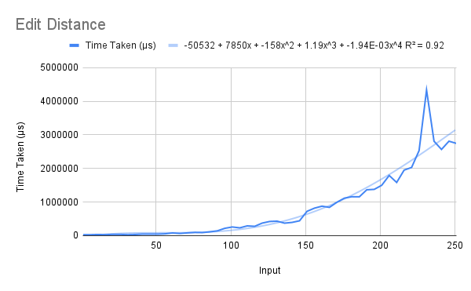
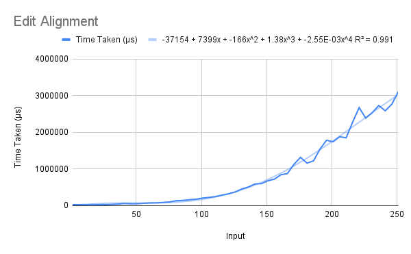
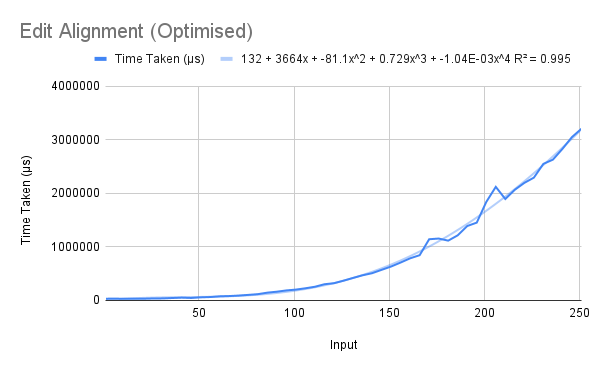
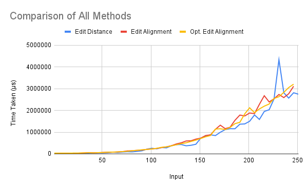

# Algorithms to Compute Edit Distance
One dynamic programming algorithm was taught in class to calculate the edit distance between two arbitrary strings. Three variations have been implemented – one simply finds the actual edit distance, and two show how to align the strings according to the edit distance. For example, on the input `malayalam` and `kannada`, the first one simply returns `6`, while the other returns `(6,("malayalam", "kann ada "))`, *i.e.*,
```
(6,
 ("malayalam",
  "kann ada "))
```
which shows that the edit distance is in fact 6.  

Of the latter two, the second implementation is more efficient (see the Explanation section).

## Running
To run one of the functions, uncomment (remove the two hyphens and the space preceding) the corresponding line in the `main` function, save the file, and recompile. When running, pass the strings as command-line arguments.
```
> ./editdist "malayalam" "kannada"
> 6
```

## Explanation
### Finding Distance
In this solution, like all others, the table is implemented as a nested list. We have a wrapper function `editdist` that calls the table-constructing function `dists` and accesses its last element.  

The first row of the table is given by `[0..n]`, and for each subsequent row, the first element is `i` (*i.e.* the first column is `[0..n]`). In each cell, the minimum of the three numbers is found and inserted, for which we use the `diff` and `min3` functions.

### Finding Alignment
This implementation has a structure identical to the previous one, except that the table contains both the edit distances as well as a pair of aligned strings, as a nested pair (as we have seen above, *e.g.*, `(6,("malayalam","kann ada "))`).  

The construction of the contents of each cell is done using the `extend` function, which finds the maximum of the three numbers and accordingly extends the parts of `x` and `y` with a space (to be taken as a null character) or a character from the string. In all cells, the strings in the pair have the same length, so the last cell also contains strings of the same length.

### Finding Alignment (Optimised)
It was predicted that the efficiency of the previous method would be reduced by the `++` (string concatenation) operator used in the `extend` function. This last function, therefore, builds the table in reverse, using the `(:)` operator (which appends to the beginning instead) to extend the strings.  

This is expected to be faster as the `(++)` operator takes time linear in the length of its first argument, while the `(:)` takes constant time. The only retarding factor in this case, then, is the reversal of strings in the base case (first row and first column) of the table.

## Analysis
Each of the three functions was run on two strings of equal length, starting from 1 and increasing by 5 till 251.  

The R² values of the best fit of various types of functions for each of the functions' running times are shown below.  

Algorithm         | Linear | Quadratic | Cubic | Biquadratic | Exponential | Power Series | Logarithmic  
----------------- | ------ | --------- | ----- | ----------- | ----------- | ------------ | -----------  
E. Distance       | 0.75   | 0.913     | 0.918 | 0.92        | 0.892       | 0.706        | 0.363  
E. Alignment      | 0.834  | 0.987     | 0.988 | 0.991       | 0.953       | 0.727        | 0.412  
E. Alignment (O.) | 0.819  | 0.99      | 0.995 | 0.995       | 0.975       | 0.71         | 0.398  

### Finding Distance
We see that the function type that fits best is a biquadratic polynomial, but it has a small leading coefficient. Nevertheless, we will see that a biquadratic dependence is theoretically justifiable as well.  

The wrapper function `editdists` takes time linear in *n* (to access the last element of the table). The `dists` function iterates over each of the *n*² cells of the table, calculating the distance for each one. However, this makes use of the list-indexing operator `!!`, which runs in linear time. Therefore, we need to take the average of ∑*ij* over all 1 ≤ *i*, *j* ≤ *n*. As is easily verifiable, this is O(*n*²). Therefore, the overall `dists` function runs in O(*n*⁴) time.  

  

### Finding Alignment
The operations involved in building the elements of each cell in the table by `edits`, in addition to `(!!)`, include `(++)` now. However, `(++)` also contributes only an *n*² term to the cell-construction, which is already *n*².  

Furthermore, the base case of the table (the first row and first column) is now quadratic in nature – the `replicate` function runs in linear time, and it is run for all `i` from 0 to *n*. This does not change the running time either, however.  

Therefore we do not expect the running time to be altered, and as we see it remains biquadratic.  

  


### Finding Alignment (Optimised)
Here, `(++)` is not involved in the construction of the table, but `(!!)` continues to be used. Therefore the table construction still runs in biquadratic time, and the overall time remains biquadratic, as we have predicted.  

There is an extra *n*² term in the running time (because each of the base strings is reversed in the first row and first column). However, we do not expect this to alter the big-O time of the function.  

  


## Comparisons
The running time of the function to find the edit alignment produces surprising results. We expect that the additional concatenation involved in building the elements of the cells of the table adds a significant amount of time (as it totals to an overall addition of time proportional to *n*²), although it does not change the big-O time.  

However, it appears to take almost exactly the same amount of time as the function that only finds the edit distance. This tell us that even though `(++)` runs in linear time, it is negligible in the range under consideration (under 250).  

Furthermore, before finding the running time of the unoptimised alignment-finding code, we expected the optimised implementation to be a significantly more efficient version. However, we have seen that the unoptimised code adds a negligible amount of time to the distance-finding code itself. This means that even the optimised version cannot be better than that.  


