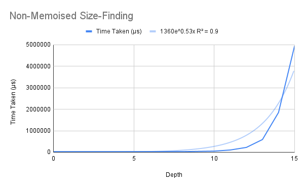
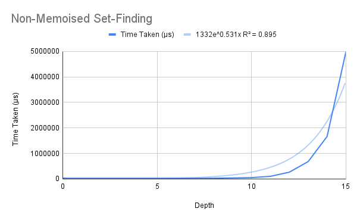
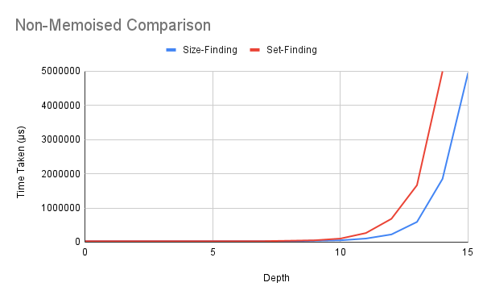
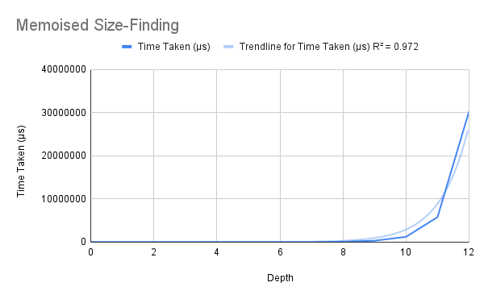
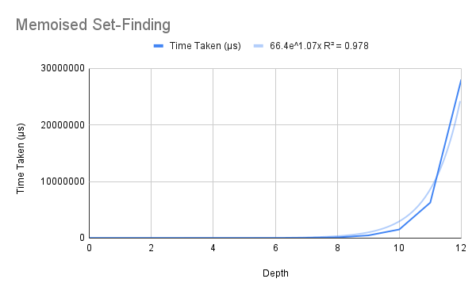
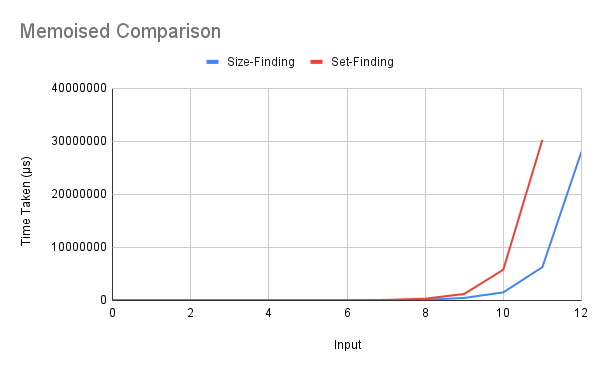
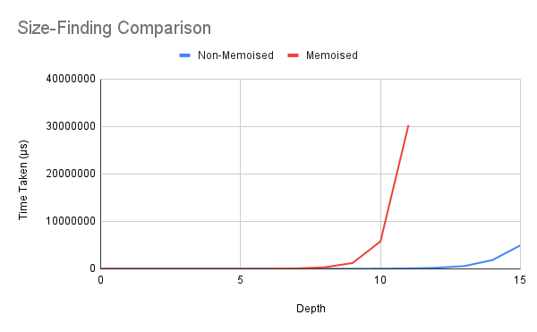
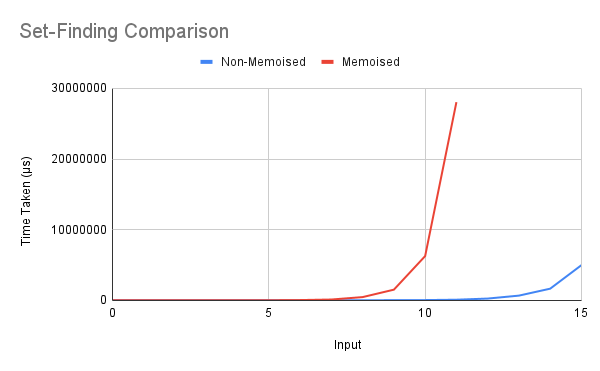

# Maximal Independent Set
One DP-based algorithm was taught in class to compute the maximal independent set of a tree. However, the data representation of trees makes the non-memoised (plain recursion) function much easier to write; thus, both (memoised and non-memoised) versions have been implemented.  

For each version, there is a function which finds only the *size* of the maximal independent set, and one which finds the set itself as well.

## Running
To run one of the algorithms, uncomment (remove the two hyphens and the space preceding) the corresponding line in the `main` function, save the file, and recompile. When running, pass the tree (see below for an example) enclosed in quotes, as a command-line argument.
```
> ./indep "Node 7 [Node 6 [Leaf 5, Node 4 [Leaf 3, Leaf 2]], Node 1 [Leaf 0]]"
> 5
```

## Explanation
### Non-Memoised
This solution implements the simple recursion given in class, without storing the results anywhere. The data representation of trees is via a recursive datatype whose value is either (i) a leaf node with a single integer or (ii) an internal node with an integer and a list of children subtrees.  

The size-finding function `maxi` directly sums the sizes of the maximal independent sets of the grandchildren subtrees, adds one to them, and takes the maximum with the sum of the sizes of the maximal independent sets of the children subtrees. It returns this value.  

Correspondingly, the set-finding function `maxiset` finds the sets, and combines them using the `union` function.

### Memoised
These functions are more complicated than the non-memoised case. Intuitively, this is because when we are given the data representation of a tree, we do not have direct access to all of it in one go; it must be traversed. On the other hand, when we used the list of edges representation, we could view the entire graph at once.  

Thus, we proceed here by returning from each node `n` a list whose *i*th element is the size of the MIS under node *i*, if node *i* is under node `n`, and 0 otherwise. The list returned from a leaf node `x`, thus, has only one nonzero value. For an internal node `n`, first we combine the lists generated by its children, and then insert the new value at index `n`.  

Similarly, in the set-finding case, we use unions and compare the sets by size to find the maximum.

## Analysis
All four functions were run on complete binary trees with depths ranging from 0 to 16 (for the non-memoised case) and 0 to 12 (for the memoised case).  

The R² values of the best fit of various types of functions for each of the algorithms' running times are shown below.  

Algorithm      | Linear | Quadratic | Exponential | Power Series | Logarithmic  
-------------- | ------ | --------- | ----------- | ------------ | -----------  
Non-M. Size-F. | 0.341  | 0.672     | 0.9         | 0.416        | 0.185  
Non-M. Set-F.  | 0.34   | 0.667     | 0.895       | 0.423        | 0.184  
M. Size-F.     | 0.305  | 0.621     | 0.972       | 0.476        | 0.172  
M. Set-F.      | 0.324  | 0.647     | 0.978       | 0.508        | 0.184  

### Non-Memoised
Clearly, given the recursion, we expect the time T(*n*) taken for depth *n* to be 4T(*n*-2) + 2T(*n*-1). This tells us that the curve must be exponential, which is unsurprising as the number of nodes, as well, is exponential in *n*.  

As expected, then, the R² value of the exponential curve is the highest.

  

For the set-finding function, we can see that once the function is run on the grandchildren and children, the sizes of the sets are computed again. Thus, we again expect an exponential curve, and it is again what we see.  

  

A quick calculation shows us that the sizes of the MISs are proportional to the sizes of the trees themselves; thus, if the `size` function is linear, this should considerably worsen the running time. However, the running times are not all that different in the two cases (at least in the given range), even though `size` runs in linear time (see [here](https://hackage.haskell.org/package/containers-0.6.5.1/docs/Data-IntSet.html) for the big-O times).  

  

### Memoised
Here again we see the R² value predicting an exponential running time. Interestingly, however, an analysis of the code reveals something else.  

Consider the time T(*n*) taken by `lists` on a tree of depth *n*. First, it runs `lists` on both its children (2T(*n*-1)), and adds the results together (2ⁿ) to get `overall`.  
Next, it indexes into `overall` six times. The first four indices range between 3 and 2ⁿ, and are therefore 2^(*n*-1) on average. Similarly, the next two indices range between 1 and 2ⁿ, and are also 2^(*n*-1) on average. Finally, insertion happens at the node-number's position, which is again 2^(*n*-1) on average.  

Therefore, we have T(*n*) = 2T(*n*-1) + c2^(*n*-1), for some constant c. Some algebra reduces this to T(*n*) = 2ⁿT(0) + cn2^(*n*-1).  

Thus, we predict a big-O running time of O(n2ⁿ) for this function – it is in fact worse than the non-memoised solution. However, we cannot generate a best-fit curve of this type to verify.

  

The size-finding case, again, is very similar – the only added complication is the use of `size`. However, we know that this is proportional to the size of set. We also know that the MISs of a tree of depth *n* has size proportional to 2ⁿ; thus the running-time analysis here will be identical to the set-finding case, except with a different value of the constant c (which we did not determine in any case).  

  

Here again we note that the `size` function does not cause a *very* great change in the running time in the given range.  

  

## Overall Comparisons
We can compare the memoised and the non-memoised algorithms among themselves. These comparisons confirm what we suspect from the theoretical analysis – the non-memoised method is much, much better. We can see hat in both cases, the non-memoised methods' times at *n*=15 remain even less than the memoised methods' times at *n*=10.  

  


