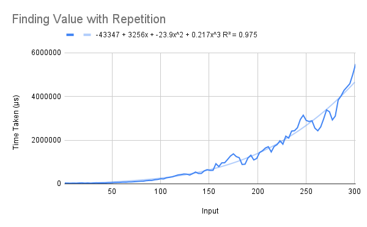
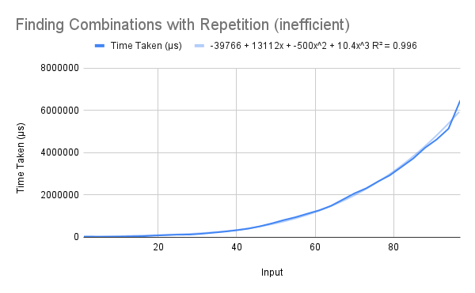
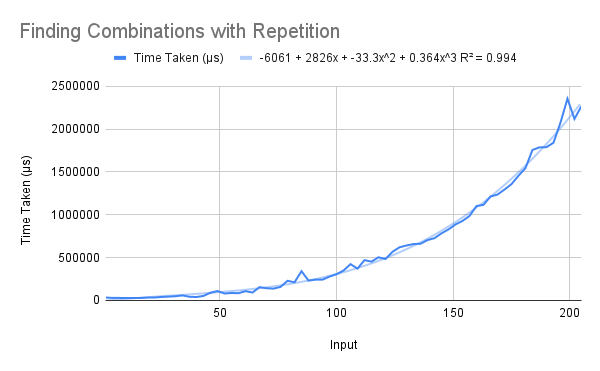
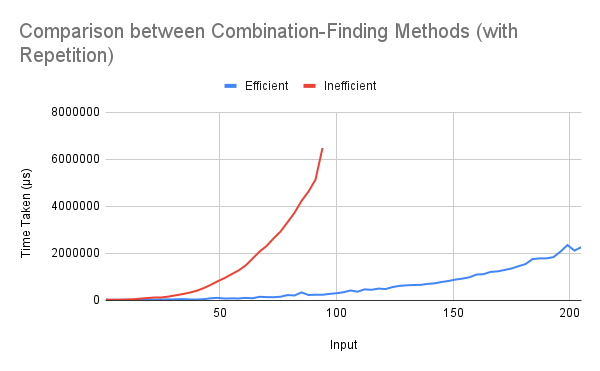
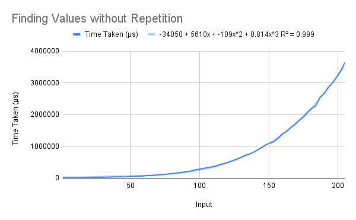
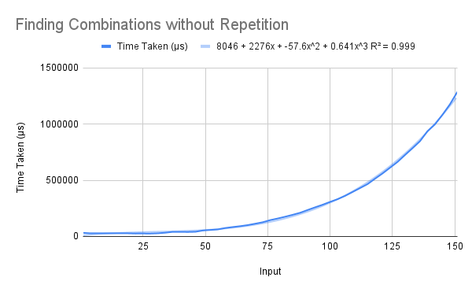
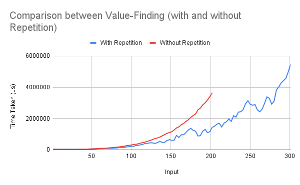
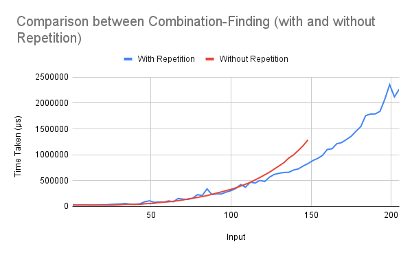

# The Knapsack Problem
Two versions of the knapsack problem were solved in class:

1. with repetition  
2. without repetition  

Both have been implemented in two ways – the first way simply finds the maximum value attainable, while the second keeps track of the actual combination of items required to achieve it.  

In the case with repetition, the combination-finding method is implemented in one efficient and one inefficient way.

## Running
To run one of the functions, uncomment (remove the two hyphens and the space preceding) the corresponding line in the `main` function, save the file, and recompile. When running, pass the list of items (weight-value pairs) enclosed in quotes, and the capacity of the knapsack as command-line arguments.
```
> ./knapsack "[(3,6),(4,9),(5,16)]" 7
> (16,[(5,16)])
```

## Explanation
### Value-Finding with Repetition
As usual, we have a wrapper function `value`, that takes in the list of items, the capacity, and returns the maximum value of items that can be taken. It calls the `sacks` function, which uses the list of items to generate a list whose i'th element is the maximum value of a knapsack of capacity i.  

`minw` is the weight of the lightest item; all knapsacks under this capacity must, therefore, be empty. This is the first part of the definition of `g`.  
Then, the recursive part checks for the maximum value of `g !! (i-w) !! v` for all `(w,v)` lighter than `i`, for each `i`. This generates an infinite list, which can be accessed for any capacity.

### Combination-Finding with Repetition
The first function for this is inefficient; it stores *only* the combinations in the list, which means it has to recalculate the values each time in order to find the maximum. In all other ways, it is identical to the value-finding method.  

A more efficient method follows – the items of the memoised list are `(value, combination)` pairs (where `combination` is a list of items). Thus, updation happens by adding the value to the first element of the pair, and appending the item to the second element.

### Value-Finding without Repitition
As was taught, here the code builds a 2-dimensional table whose `(i,j)`th element stores the maximum value of a knapsack of capacity `i`, using only items `0` to `j`.  

Here too, we have a wrapper function `val`, and the table-building function `sack`. The table's first `minw` elements are lists of zeroes, as these knapsacks cannot take any elements. Thereafter, for each `w`, we iterate through the list of items, and check if they improve the value.

### Combination-Finding without Repetition
This function is parallel to the value-finding one; the only difference is that it stores the value along with the list of items needed to achieve it. Thus, again, the table-building function `cmb` adds the value to the first element and appends the item to the second element in order to extend the table.

## Analysis
The list of items is generated randomly, with all weights and values between 1 and 10. The capacity of the knapsack is uniformly chosen to be 10 times the number of items, in both cases.  

The R² values of the best fit of various types of functions for each of the algorithms' running times are shown below.  

Algorithm                   | Linear | Quadratic | Cubic | Biquadratic | Exponential | Power Series | Logarithmic  
--------------------------- | ------ | --------- | ----- | ----------- | ----------- | ------------ | -----------  
V.-Finding with R.          | 0.823  | 0.968     | 0.975 | 0.977       | 0.969       | 0.773        | 0.433  
C.-Finding with R. (ineff.) | 0.797  | 0.984     | 0.996 | 0.997       | 0.989       | 0.776        | 0.41  
C.-Finding with R. (eff.)   | 0.833  | 0.985     | 0.994 | 0.995       | 0.99        | 0.763        | 0.44  
V.-Finding without R.       | 0.763  | 0.98      | 0.999 | 1           | 0.994       | 0.7          | 0.373  
C.-Finding without R.       | 0.781  | 0.983     | 0.999 | 1           | 0.999       | 0.646        | 0.39  

### Value-Finding with Repetition
Although the biquadratic best-fit has a slightly better R² value, we can show that the code should run in cubic time in the number of items (given the selection of the capacity).  

First, the wrapper function `value` sorts the items by weight. This, however, does not take longer than `nlogn` time, and can be ignored. The indexing, since it occurs in linear time, can also be ignored.  
Next, `sacks` obtains a value for each `i` (a factor of W), by taking a maximum (a factor of `n`) over all `(w,v)` where `w ≤ i`. Note, however, that since indexing is linear, the inner list takes quadratic time to be generated. Thus we have an overall time proportional to n²W.  

As we have noted above, W = 10n in all cases. Thus we should get time cubic in `n`.

  

### Combination-Finding with Repetition
We first consider the inefficient implementation. Here too, the biquadratic R² value is slightly greater, but the code ought to run in cubic time. We can show this in exactly the same manner as we did in the value-finding case.  
The `items` wrapper function only sorts and indexes, and can therefore be ignored. The `combs` function iterates through all `i` less than `W`; for each of these, it first generates the list of all possible items that can be added to the current knapsack (which takes n² time, as we have seen), and then finds the maximum by summing up over the values of each combination (which takes time bounded by n²). This gives us a cubic-time function.  

  

In the case of the efficient implementation, the sum is stored along with the combination, as we have seen. In an analogous manner to the inefficient function and the value-finding function, it also takes cubic time (as the list is extended in constant time after indexing).  

  

We can compare the two implementations' running times, to see the difference. We note that even though the big-O time is the same, the inefficient method takes 20 times longer than the efficient one at `n`=97. This is a measure of the extra time taken by the `sum` function.  

  

### Value-Finding without Repetition
As we have seen, this implementation builds a table of size `nW`. Here, however, each item of the table takes only linear time to obtain, and therefore the running time remains cubic.  

The `sack` function, which creates the table, goes through all weights less than `W`, and then for each item in the list, it adds it (if possible) to the current knapsack. The indexing in the generation of each element makes it linear; thus we have an O(n²W) time function again, which is cubic.  

  

### Combination-Finding without Repetition
This function proceeds in an exactly similar manner to the value-finding case, except that as the value and combination are stored together, the maximum is taken by comparing the first element (`maxByF`). The base case also has to be changed to account for this.  

The running time, then, does not change; only a constant time is added in this case. We therefore continue to have a cubic-time function.  

  

## Overall Comparisons
We will compare the value-finding and combination-finding functions with and without repetition.  

The comparison of the value-finding functions shows that the without-repetition case is slightly more time-consuming. This is to be expected, as the call of the `zip` function in this case must add to the running time considerably.  

  

Correspondingly, the combination-finding functions show a similar difference. However, the magnitude of the difference is not as much as in the value-finding case; this could be because the extra computation involved in finding the combination with repetition pushes its running time up slightly in comparison to the value-finding function's.  

  
