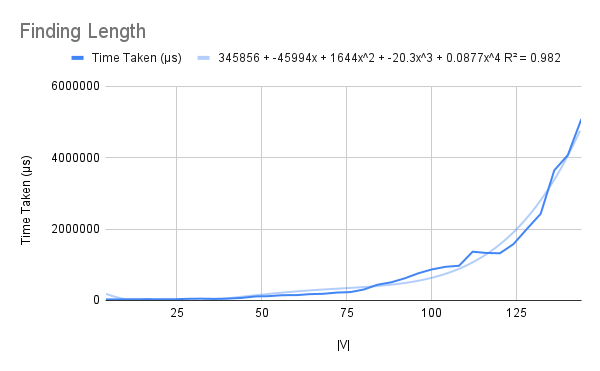
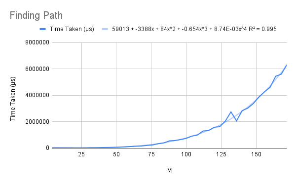
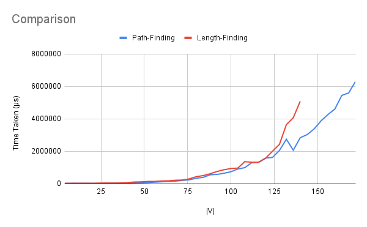

# Shortest Reliable Path
One dynamic programming-based algorithm was covered in class to compute the shortest reliable path (least-weight path using at most *k* edges) between two nodes in a graph.

## Running
To run one of the algorithms, uncomment (remove the two hyphens and the space preceding) the corresponding line in the `main` function, save the file, and recompile. When running, pass the graph (pair of list of vertices and list of edges, with source, destination and weight), enclosed in quotes, followed by the source vertex, the destination vertex, and *k* as command-line arguments.
```
./relpath "([0,1,2,3,4,5,6,7],[(0,3,7),(0,4,3),(0,5,6),(1,2,2),(1,3,1),(1,4,0),(1,6,5),(1,7,1),(2,3,1),(2,4,3),(2,5,1),(2,6,8),(3,6,1),(4,5,4),(5,6,6),(5,7,7),(6,7,2)])" 0 6 4
(8.0,[(3,6.0,1.0),(0,3.0,7.0)])
```

## Explanation
### Finding the Weight
The `srpl` function is a wrapper function that finds the *weight* of the shortest reliable path in the graph. It calls `lengths`, which generates a table whose (i,j)th element is the length of the shortest path from the source `s` to node `i` which takes at most `j` edges.  

It iterates through all edges, assigning 0 for paths from `s` to `s`, and checking for the shortest path to a node leading to the current node for all others (as taught in class).

### Finding the Path
This pair of functions mirrors the length-finding solution closely; the only difference is in the creation of elements of the table.  

In this case, along with the length of the path, the actual path itself is stored; the base case is an empty path `[]` for a path from `s` to `s`, and successive nodes added to the path are appended to the beginning (to keep it constant-time).

## Analysis
The functions were each run on 75% complete directed graphs with |V| varying from 4 to about 150. `s` is uniformly chosen to be 0, and `d` to be the last node; `k` is uniformly chosen to be ¾|V|.  

The R² values of the best fit of various types of functions for each of the algorithms' running times are shown below.  

Algorithm      | Linear | Quadratic | Cubic | Biquadratic | Exponential | Power Series | Logarithmic  
-------------- | ------ | --------- | ----- | ----------- | ----------- | ------------ | -----------  
Length-Finding | 0.63   | 0.893     | 0.961 | 0.982       | 0.978       | 0.796        | 0.344  
Path-Finding   | 0.758  | 0.977     | 0.995 | 0.995       | 0.985       | 0.798        | 0.427  

### Length-Finding
Analysing this code for a running time is simple. The R²-based prediction of a biquadratic time holds.  

First `srpl` takes time bounded by O(|V| + k), for indexing, in addition to the call of `lengths`. The latter iterates through each vertex `v` (a factor of |V|), and for each `i` ≤ k (a factor of k), it finds all edges leading to `v` (which takes time proportional to |E|) and gets the relevant item by indexing (time O(|V| + k) on average). This gives us a total time proportional to |V|k(|E| + |V| + k).  

As noted above, k = O(|V|), and |E| = O(|V|²). This gives us an overall time biquadratic in |V|, which is what we find.  

  


### Memoised Solution
As the code is so similar to the length-finding code (as noted in the Explanation section) a theoretical analysis proceeds in exactly the same way, obtaining the same result. The R² value also supports this conclusion.  

Notably, however, the leading coefficient is very small (smaller than in the length-finding case by a factor of 10) for this best-fit line. The reason for this is not clear.  

  


## Comparisons
The comparison of both the functions shows an extremely surprising result – path-finding takes uniformly *less* time than simple length-finding. The reason for this, too, is not clear. It is possible that the last few values of the length-finding times suffered a fluctuation that raised them higher than their normal value, but this is unlikely.  

  

