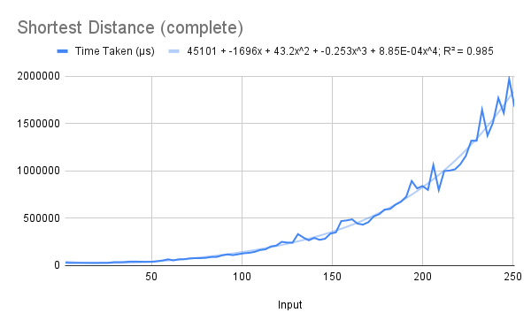

# Shortest Path in a DAG
A single algorithm to find the shortest path between two vertices in a DAG was taught. It maintains a list of the distances from the source node to all the others.

## Running
There are two functions: one to find the shortest *distance* between two vertices, and one to find the shortest *path* between two vertices. To run one of them, uncomment the corresponding line and pass the graph (a pair consisting of a list of vertices, and a list of edges, each of which is a `((source, destination), weight)` pair) enclosed in quotes, followed by the source node, and the destination node. The example shown is of the latter function.
```
> ./shortest "([0,1,2,3,4,5], [((0,1),4), ((0,2),2), ((1,2),5), ((1,3),10), ((2,4),3), ((4,3),4), ((3,5),11)])" 0 5
> (20,[0,2,4,3,5])
```

## Explanation
First, a function for toposorting the nodes of the graph is defined. Note that as toposorting traditionally involves stack manipulation (*i.e.*, state-based programming), the code appears slightly convoluted.  
There are two elements of the state for toposorting: the stack and the list of visited nodes. The stack is represented as a simple list of vertices (integers) and the visited list as a list of booleans. This assumes that the set of vertices is of the form `[0..n]`.  
The state is, therefore, a `(stack, visited)` pair. The `topo` function takes the list of edges, a vertex, and the state, and returns the updated state. The `toposort` function repeatedly applies `topo` on the initial state with each of the vertices (using `foldl`). For instance, if `es` is the list of edges and the list of vertices `vs` is `[0,1,2]`, the `foldl` expression is equivalent to
```
((flip $ topo es)
    ((flip $ topo es) 
        ((flip $ topo es) s 0) 1) 2)
```
`flip` changes the order of arguments, so `((flip $ topo es) s 0)` is in fact `topo es 0 s`.  

The `dist` function constructs a list of distances from a vertex `s` to all the other vertices. It assigns `0` as the distance from `s` to `s`, and then for each `v` in the toposorted list of vertices, it finds the list of vertices leading to it (using `adjwts`), the distances up to them (using `find` on the list itself), adds the corresponding edge's weight to them, and finds the minimum (using `min'`).  
`getDist` is a wrapper to lookup the required destination's entry in the list generated by `dist`, and return only the distance.  

The `paths` function is almost identical to the `dist` function, except that it maintains the path up to the current vertex for each destination. `getPath` also performs an analogous wrapping function.

## Analysis
Both `getDist` and `getPath` were run on three types of graphs: complete (edges between all pairs), half-complete and quarter-complete.  
The R² values of the best fit of various types of functions for each of the functions' running times on each type of input are shown below.  

Algorithm            | Linear | Quadratic | Cubic | Biquadratic | Exponential | Power Series | Logarithmic  
-------------------- | ------ | --------- | ----- | ----------- | ----------- | ------------ | -----------  
Distances (complete) | 0.794  | 0.987     | 0.984 | 0.985       | 0.983       | 0.764        | 0.433  
Distances (50%)      | 0.836  | 0.975     | 0.984 | 0.987       | 0.986       | 0.732        | 0.474  
Distances (25%)      | 0.795  | 0.956     | 0.967 | 0.968       | 0.963       | 0.655        | 0.438   
Paths (complete)     | 0.817  | 0.972     | 0.976 | 0.977       | 0.961       | 0.768        | 0.452  
Paths (50%)          | 0.839  | 0.983     | 0.988 | 0.989       | 0.987       | 0.72         | 0.472  
Paths (25%)          | 0.826  | 0.979     | 0.985 | 0.985       | 0.98        | 0.66         | 0.463  

### Distances
We note that the highest R² value is that of the biquadratic curve, although its leading coefficient is small. This leads us to believe that the code ought to run in at least cubic time; let us theoretically analyse it to verify this.  

First, we see that the `getDist` function takes constant time and can therefore be ignored. The `dist` function generates a list of the distances from a source node `s` to all other nodes. First it toposorts the nodes (which takes |V|³ time), and then for each node `v` different from `s` (a factor of |V|), it finds the all vertices that have an edge leading to `v` (a factor of |E|). It then looks up these vertices in the same list (we know it has already calculated them because we are accessing `v` in toposorted order), taking |V| time, and adds the connecting edge's weight, takes the minimum over all connecting edges, and adds it to the list.  
Therefore, this is a total of |V|³ + |V|(|E|+|V|)(the number of connecting edges). Now, we know from the way the input sets were constructed that the number of connecting edges is proportional to |V| in all three.  
This gives us a running time of O(|V|⁴), as predicted. We see that all three input sets have a biquadratic best-fit curve with a high R² value.  

  

  

  

A comparison of the graphs for each of the input sets gives us additional evidence for this, as |V| is constant across all and only the percentage of pairs of vertices connected by edges changes. Thus, we expect that the input set of half-complete graphs takes half as much time as that of fully complete graphs, and similarly for the quarter-complete set.  


### Paths
We note some differences between the path-finding and the distance-finding functions. First, the wrapper function `getPath` does not take constant time; it takes time to reverse the path (in case it is not empty). This is bounded by |V|, which does not affect the running time of O(|V|⁴).  
Second, having found all connecting edges, the combination involves both addition and appending to the beginning of a list. These are both, however, constant-time operations; hence the running time does not change with this either.  

Therefore, we expect a biquadratic best fit for this function as well, and this is what we obtain.  

  

  

  

A comparison of the three graphs, again, yields confirmation of our big-O estimate – each input set takes approximately half as much time as the previous one, as predicted by the linear dependence on |E|.  


## Overall Comparisons
We can compare the running times on each input set separately, between the functions for finding distance and finding path.  

  

  

  

These plots also confirm our previous estimates; the two functions run in almost identical times in all three cases. The extension part of the code (which is the main logical difference between the functions) takes constant time in both functions, and the reversal appears to take negligible time in comparison to the fourth-order terms provided by the dynamic programming.  


## Note
It was realised after testing that the toposorting is in fact redundant. Since Haskell is lazy, the elements of the list can be generated in any order by the `dist` and `paths` function; they will be accessed as required and then stored permanently. For example, if vertex 3 needs the distance up to vertex 5, it is not necessary to have calculated the distance up to vertex 5 first; it will be calculated as soon as the distance to vertex 3 as needed.  

That the code runs even without toposorting can be easily verified (by commenting out the respective lines, recompiling and running again); but detailed benchmarking was not carried out.  

However, it is expected eliminating toposort will not alter the *complexity* of the running time (since toposorting contributes only a cubic term) although it may significantly improve the actual *running time*.
