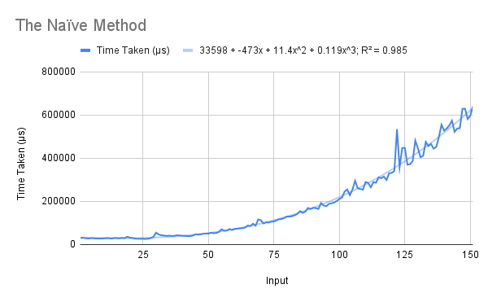
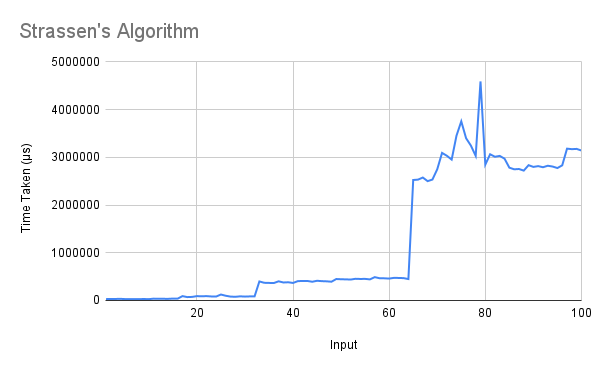
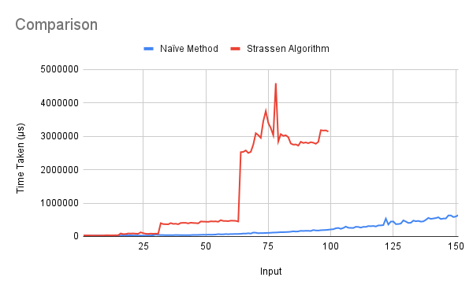
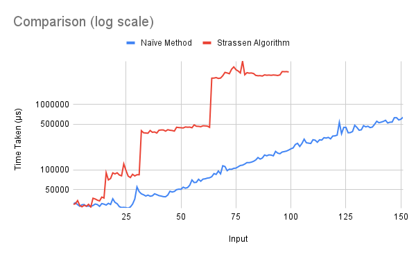

# Matrix Multiplication
Two algorithms were taught in class to multiply two nxn matrices:

1. the naïve method  
2. Strassen's algorithm  

Both have been implemented under the same names. Matrices are represented as two-level nested lists in a row-major fashion, *e.g.*, `[[1,2],[3,4]]` is the matrix whose first row contains 1 and 2, and second row contains 3 and 4.

## Running
To run one of the algorithms, uncomment (remove the two hyphens and the space preceding) the corresponding line in the `main` function, save the file, and recompile. When running, pass the matrices (enclosed in quotes) as command-line arguments, in the format described above.  
```
> ./matmult "[[1,2],[3,4]]" "[[5,6],[7,8]]"
> [[19,22],[33,50]]
```

## Explanation
### The Naïve Method
This is the ordinary "paper" method for matrix multiplication, which takes the dot product of each row of the first matrix with each column of the second. It takes the transpose of the second matrix in order to access the columns easily, and then takes the dot product.

### Strassen's Algorithm
This method proceeds in the way described in class, by splitting the matrices into four parts each, computing 7 products, and deriving the four parts of the product matrix by additions and subtractions on these products.  

In the case of odd *n*, an extra row and column of zeroes are added to the matrix before splitting, and these are removed (using `tail`) after multiplication.  

The `split` function returns two pairs, the first containing the two submatrices in the top half, and the second containing those in the bottom half. The `join` function attaches four small ((n/2)x(n/2)) matrices to make one big (nxn) matrix.

## Analysis
The R² values of the best fit of various types of functions for each of the algorithms' running times are shown below.  

Algorithm       | Linear | Quadratic | Exponential | Power Series | Logarithmic  
--------------- | ------ | --------- | ----------- | ------------ | -----------  
The Naïve Method | 0.255  | 0.542     | 0.974       | 0.361        | 0.113  
Strassen's A.    | 0.974  | 0.99      | 0.984       | 0.807        | 0.637  

The best fit curve is not considered for Strassen's method as the R² values show that the trendline is not accurate for any standard type of function.  

### The Naïve Method
This method follows a cubic-time algorithm, as computing each element of the product (which is an nxn matrix) takes time linear in *n*. The cubic best-fit line has a very high R² value, which corresponds to the predicted running time.  

  

### Strassen's Algorithm
The results obtained from running this algorithm are very surprising. Although it is predicted to run in O(n^log7) time, the graph shows no noticeable pattern (in the range 0 to 100), and is extremely irregular.  

One possible reason for this is the slowness induced by the calls to `split` and `join`. The nested-list representation of matrices makes both these procedures slightly inefficient – `split` runs in linear time and `join` in quadratic time. Furthermore, the additions and subtractions of the products are of necessity quadratic.

  


## Comparisons
As noted above, the Strassen algorithm is much more inefficient than the naïve method, paradoxically. Its big-O time is also not predictable from its graph. A comparison between the two running times shows that the naïve method's running time increases much more slowly and stays well below the Strassen method's in the same range.  

  

A log scale comparison shows the difference slightly more clearly.

  

