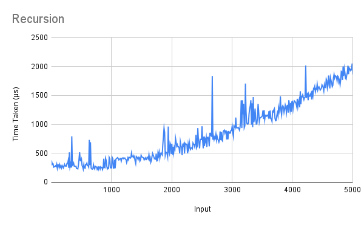

# Mergesort
Two variations on the mergesort algorithms were covered in class:

1. recursion  
2. iteration  

Both have been implemented in the file. They both make use of the same `merge` function.  

## Running
To run one of the algorithms, uncomment (remove the two hyphens and the space preceding) the corresponding line in the `main` function, save the file, and recompile. When running, pass the list (enclosed in quotes) as a command-line argument.
```
> ./mergesort "[3,1,4,1,5,9]"
> [1,1,3,4,5,9]
```

## Explanation
### Recursion
This solution is essentially identical to the ordinary recursive definition of the mergesort algorithm. The first two lines define the base cases; the last line splits the input list in half (at the index `((length xs) \`div\` 2)`), mergesorts each sub-list, and merges them.

### Iteration
This solution superficially mirrors the queue-based algorithm shown in class. The queue is implemented as a simple list, on which the eject-merge-inject procedure is applied repeatedly `until` it has only one element left.  

The `until` function used here is one Haskell's standard in-built functions, defined in the Standard Prelude. Its definition is given. The fact that it is defined recursively is the reason for calling this only a *superficial* implementation of the iterative solution; it is in fact also recursive under the hood. One way to iteratively implement `until` would appear to be as follows:

```hs
until2 :: (a -> Bool) -> (a -> a) -> a -> a
until2 p f x = head $ dropWhile (not . p) [foldr ($) (replicate i f) x | i <- [0..] ]
```

This would, however, be extremely inefficient, due to the calls of `dropWhile`, `foldr` and `replicate`. Furthermore, all these functions have recursive definitions under the hood as well – it is merely a more roundabout way to achieve the same end.  

There is still a big difference in the operation of the so-called iterative code, however – it acts bottom-up and not top-down. It does not use the `splitAt` function at all.

## Analysis
The R² values of the best fit of various types of functions for each of the functions' running times are shown below.  

Algorithm | Linear | Quadratic | Exponential | Power Series | Logarithmic  
--------- | ------ | --------- | ----------- | ------------ | -----------  
Recursion | 0.881  | 0.955     | 0.952       | 0.595        | 0.475  
Iteration | 0.43   | 0.462     | 0.44        | 0.288        | 0.231  

The best fit curve is not considered for the recursive methods as the R² values show that the trendline is not accurate for any standard type of function.  

### Recursion
This version's running time remains roughly constant in the range 0 to 3000, but then fluctuates a lot before returning to a stable state. However, it is remarkably efficient for a recursive solution.  

This is possibly due to the Haskell compiler (`ghc`) optimising recursion. Since Haskell is functional, it relies heavily on recursion, and therefore the compiler reduces the impact of this as much as possible in the object code.

  


### Iteration
This implementation is noticeably more regular than the recursive one, but it increases much, much faster, even in the same range. As noted above, the function is not truly recursive – its main distinction from the previous version is that it is bottom-up rather than top-down.  

It appears interesting that it is so much slower than the first solution, since in imperative languages, iterative solutions are typically more efficient due to function call overheads. In Haskell, however (as noted above), the minimisation of these overheads is prioritised, since the language depends on them to a huge extent.  
An explanation for the inefficiency of the second method can be given by an analysis of its running time. This, significantly, does *not* turn out to be identical to the expected O(nlogn), because `(++)`, the concatenation operator, is linear in the length of its first operand. Using it in the queue manipulation is a possible source of the inefficiency.  

To analyse the runtime, we note that the queue starts with *n* elements, *i.e.*,
```hs
[[x] | x <- xs]
```
and at each step, its length reduces by 1, until it has one element. Thus (*n*-1) steps take place. We now consider the operations that take place in each step.  
At the first step, the first argument of `(++)` has (*n*-2) elements; at the second, (*n*-3); and so on. Thus the `(++)` takes O(*n*) time.  
In addition, the `length` function is applied on the queue at each step, and it too runs in linear time.  
Thirdly, `merge` is linear in the sum of the lengths of its arguments, but this is bounded above by *n*. We can therefore ignore it.  

Hence, we have O(*n*) steps that each run in O(*n*) time, which makes this implementation, in fact, quadratic. This explains to some extent the extra running time. The quadratic best fit line, too, has a very high R² value.

![Running Time of the Iterative Implementation)(Iter.png)  

## Comparisons
The graph illustrates the extreme difference between the two implementations' running times very clearly. After *n* = 2000, the iterative method rises well above the recursive method and does not touch it even when the latter spikes after *n* = 4000.

  
