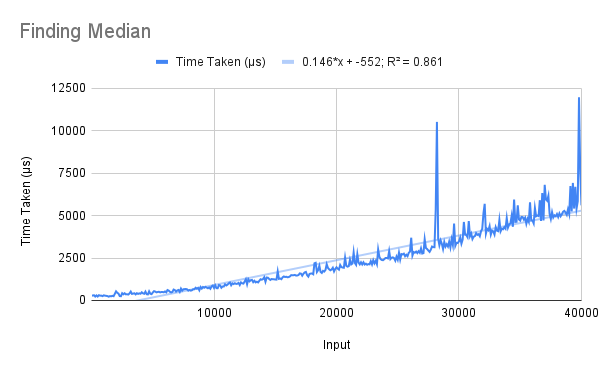

# Order Statistics (Median)
The median-finding problem was generalised to the order statistics problem (finding the *k*th smallest number in a list) in class. As the deterministic method was focused on, it has been implemented. The randomised solution has *not* been implemented.  

The solution to the order statistics problem is coded, but only median-finding is benchmarked and tested (as testing the dependence of running time on two inputs would time-consuming).  

Note that the median of a list with (2*k* + 1) elements is the middle one (the *k*th one), and that of a list with 2*k* elements is the one *after* the middle (also the *k*th one) (with 0-based indexing).  
For the latter case, the conventional median can be found by taking the average of the returned value and the immediately preceding element. This is not done to avoid an extra call to the `length` function to check the parity of the list.

## Running
To run one of the algorithms, uncomment (remove the two hyphens and the space preceding) the corresponding line in the `main` function, save the file, and recompile. When running, pass the list (enclosed in quotes) as a command-line argument.
```
> ./orderstat "[2,7,1,8,2,8]"
> 7
```

## Explanation
The `selection` function has the same effect as the function of the same name taught in class, and is implemented in an analogous manner. The pivot `piv` is chosen by finding the median of the 5-element sublists, and used to divide the input list into `smaller`, `equal` and `larger`. Then `k` is tested and the recursion proceeds or returns accordingly.  

The `median` function applies `selection`, passing `k` as half the length of the list.  

`med5` is a function for finding the median of a list with 5 elements or fewer. It proceeds by sorting (insertion sort) the input list and then picking the middle element. Since its input is bounded, its running time is constant.

## Analysis
The R² values of the best fit of various types of functions for the algorithm's running time are shown below.  

Linear | Quadratic | Exponential | Power Series | Logarithmic  
------ | --------- | ----------- | ------------ | -----------  
0.861  | 0.905     | 0.889       | 0.741        | 0.473  

The estimated complexity of the function is linear, but the quadratic and exponential R² values are better than the linear one. This could be because of the limited range, but it is also possible that the code itself runs in approximately quadratic time due to the repeated function calls.  


