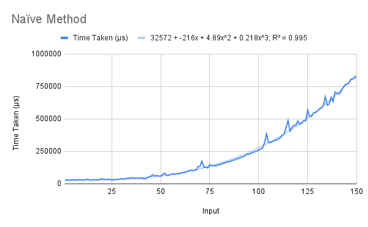
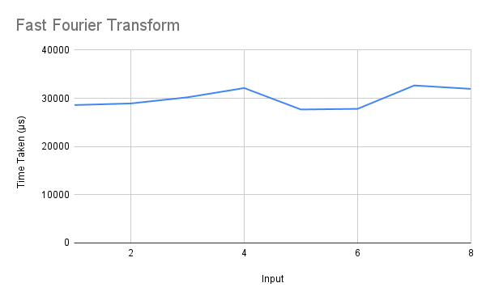

# Polynomial Multiplication
Two algorithms were taught in class to multiply two arbitrary polynomials:

1. the naïve method  
2. FFT-based recursion  

Both have been implemented under the same names.

## Running
To run one of the algorithms, uncomment (remove the two hyphens and the space preceding) the corresponding line in the `main` function, save the file, and recompile. When running, pass the list of coefficients of the polynomials (enclosed in quotes, starting from 0) as command-line arguments:
```
> ./polymult "[1,2,3]" "[4,5,6]"
> [4,13,28,27,18]
```

## Explanation
### The Naïve Method
This method is the ordinary brute-force method of multiplying polynomials, by taking the sum of the products of the coefficients of all terms whose powers sum to the power of the current term. List comprehensions are used for this.

### FFT-Based Recursion
This solution uses the `fft` function, which takes a polynomial (a list of complex coefficients), the (2^*k*)th root of unity, and the number 2^*k*, and returns the value representation of the polynomial.  

It follows the ordinary recursive FFT algorithm – it computes the FFT of the even and odd powers, and combines them using `zipWith3`. Its base case is when the complex root passed is equal to unity.  

The actual multiplication function `pmul2` calls it to convert its arguments to, and convert its output from, value representation.

## Analysis
The R² values of the best fit of various types of functions for the naïve algorithm's running times are shown below (cubic has been added as it is the predicted complexity of the naïve method).  

Linear | Quadratic | Cubic | Exponential | Power Series | Logarithmic  
------ | --------- | ----- | ----------- | ------------ | -----------  
0.842  | 0.992     | 0.995 | 0.989       | 0.727        | 0.474  

The recursive method could not be run on sufficient inputs to generate an informative graph.  

Note that in the data, the input is the *length of the input list* and *not* the degree of the input polynomial. The degree of the polynomial represented by a list of length *n* is (*n*-1).

### The Naïve Method
The running time of this method strongly bears out the theoretical analysis, producing a best-fit cubic polynomial with a very high R² value. Moreover, its leading coefficient is significant, unlike many cases when higher-degree polynomials produce high R² values.  

  

### FFT-Based Recursion
This function, while it has a reasonable running time (as far as could be ascertained), causes a stack overflow when called on polynomials of degree 8 or greater. This is surprising, since the number of recursive calls is only linear in $n$ and should not exceed about 50 in this range.  

For polynomials of degree between 0 and 7, its running time remains in the range 28-32 ms. The naïve method has a similar running time on inputs of this size.  

For these reasons, the graph of the running times of this function is not informative.

  

## Comparisons
Due to the great difference in the ranges, a graph comparing both the functions' running times would not be useful. In any case, we can note by observation that upto degree 8, the running times are roughly similar.  
