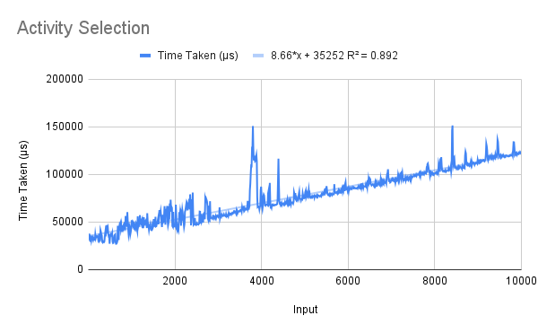

# Activity Selection
One greedy algorithm was taught in class for the activity scheduling problem. It has been implemented the same way.  
## Running
To run one of the algorithms, uncomment (remove the two hyphens and the space preceding) the corresponding line in the `main` function, save the file, and recompile. When running, pass *n* as a command-line argument.
```
> ./actsel "[A 1 3, A 2 5, A 4 7, A 1 8, A 5 9, A 8 10, A 9 11, A 11 14, A 13 16]"
> [A 11 14,A 8 10,A 4 7,A 1 3]
```

## Explanation
The code is recursive, although it simulates an iterative algorithm. The wrapper function `select` sorts the activities according to their finish time and passes them to `select'`, whose first argument keeps track of the activities already selected and whose second argument is the list of activities left to choose from.  

`select'` takes the first activity if it has not selected anything so far; it returns if no activities are left to be selected; and in all other cases, it adds the earliest activity possible to its list if it is compatible.  

Mergesort is used to sort the activities.

## Analysis
The R² values of the best fit of various types of functions for the algorithm's running times are shown below.  

Linear | Quadratic | Exponential | Power Series | Logarithmic  
------ | --------- | ----------- | ------------ | -----------  
0.892  | 0.892     | 0.879       | 0.785        | 0.68  

The graph appears to show an almost linear running time for the code, although the R² value for it is not very high. The expected running time (theoretically) is *n*log*n*, but we have seen in [the mergesort code](https://github.com/Abhinav271828/AAD-Project_2020114001/tree/main/DivAndConq/Mergesort) that it runs in nearly linear time as well. Having sorted, the `select'` function runs in linear time, which explains why the graph appears as it does.  


