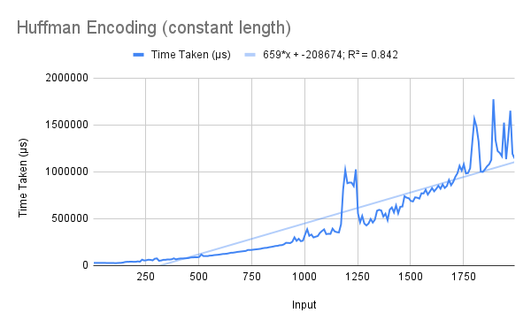
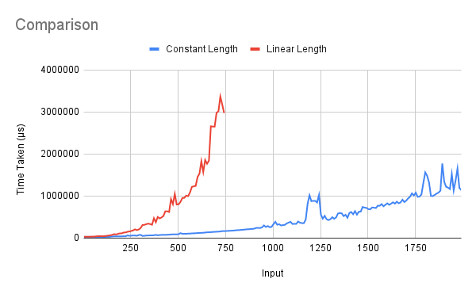

# Huffman Encoding
One algorithm was taught in class to generate the Huffman encoding of a set of symbols with frequencies given. As the algorithm is independent of the frequencies being between 0 and 1, this is not checked – any set of real numbers is accepted as the frequencies.

## Running
To run the algorithms, pass the list of symbols (strings, enclosed in escaped quotes) and their frequencies (real numbers or integers) as a list of pairs (enclosed in quotes) as a command-line argument.
```
> ./huffman "[(\"A\", 25), (\"B\", 25), (\"C\", 20), (\"D\", 15), (\"E\", 10), (\"F\", 5)]"
> [("C",20.0,"00"),("A",25.0,"01"),("B",25.0,"10"),("D",15.0,"110"),("F",5.0,"1110"),("E",10.0,"1111")]
```

## Explanation
The algorithm proceeds in three main steps – processing the list of strings to a list of trees (see below), merging the trees together, and traversing the tree to generate the codewords.  

The tree datatype is defined in such a way that the nodes contain no data, and only the leaves contain `(String, Float)` pairs. Thus the initial list of *n* codewords is converted to a list of trees consisting only of one leaf each, and pairs of these are successively merged (*n*-1) times, leading to a single tree whose leaves contain all the codewords.  

The tree is then traversed recursively – at a leaf, an empty codeword `""` is returned, while at a node, `0` is prepended to all the left child's codewords, and `1` to all the right child's. The lists are concatenated and returned.

## Analysis
The algorithm is run on two sets of inputs. In both of them, the frequencies are randomly generated numbers from 0 to 9. In the first set, however, the lengths of the symbols increase linearly, *i.e.*, the first symbol is `a`, the second `aa`, and so on. In the second set, the symbols are of roughly constant length – they are numbers from `100` to `2100`.  

The R² values of the best fit of various types of functions for the algorithm's running time on each of the input sets are shown below.  

Algorithm       | Linear | Quadratic | Exponential | Power Series | Logarithmic  
--------------- | ------ | --------- | ----------- | ------------ | -----------  
Linear Length   | 0.768  | 0.955     | 0.981       | 0.73         | 0.372  
Constant Length | 0.842  | 0.919     | 0.9         | 0.781        | 0.468  

A first look at the code shows that it should run in quadratic time on the linear-length input set. The processing parts of the algorithm depend only on the number of symbols; only codeword generation and checking equality of strings depends on the length of the strings.  

The R² value of the quadratic function is correspondingly high. However, a more detailed analysis would give the running time to be proportional to *n*² + *nE*, where *E* is the Shannon entropy of the distribution. This is under the assumption that the average Huffman codeword length is approximately equal to the entropy (as each character in all the codewords is generated one by one).  
This could be the reason for the curve appearing almost exponential.  

  

Correspondingly, on the constant-length input set, the code should run in time proportional to *n* + *nE*, as the string-comparison part of the algorithm runs in constant time. The only variation is the number of symbols and the total length of codewords.  
This explains why the quadratic R² value is greater than the linear one, even though we initially expect a purely linear dependence.  

  

We can compare the two running times to see how important the length of the codeword is, as opposed to the actual processing and generation. The comparison shows that the length of the codewords is in fact a huge retarding factor – the a linear-length input set of 750 symbols takes approximately 18 times as long as a constant-length input set of the same size, and approximately 2.5 times as long as a constant-length input of 2000 symbols.  
This shows that the actual processing of the algorithm is remarkably efficient. A great deal of the total time taken by the algorithm is in fact used for comparing the symbols.  


