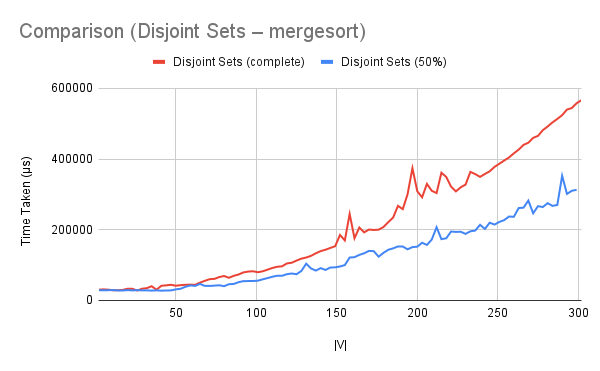

# Kruskal's Algorithm to Find MST
Three variations of Kruskal's algorithm were taught in class to find the MST of an arbitrary connected undirected graph:

1. the ordinary iterative method  
2. the disjoint set method  
3. the disjoint set method with path compression  

The first two have been implemented under the same names. The second method was implemented twice using two different sorting algorithms, insertion sort and mergesort (the two implementations are otherwise identical). Path compression was not added as it relies on pointers, which are not present in Haskell.  

## Running
To run one of the algorithms, uncomment (remove the two hyphens and the space preceding) the corresponding line in the `main` function, save the file, and recompile. When running, pass the graph (enclosed in quotes) as a command-line argument. A graph is a pair whose first element is a list of integers (representing vertices) and second element a list of triples of integers (representing the source, destination and weight of edges).
```
> ./kruskal "([0,1,2,3,4,5,6,7,8,9],[E 0 3 8,E 0 5 5,E 1 2 1,E 2 3 5,E 2 5 6,E 2 7 6,E 3 7 8,E 6 9 1,E 7 8 0,E 8 9 7])"
> ([0,1,2,3,4,5,6,7,8,9],[E 8 9 7,E 2 5 6,E 2 7 6,E 0 5 5,E 2 3 5,E 1 2 1,E 6 9 1,E 7 8 0])
```

## Explanation
### Iteration
This method is named "iteration" as only a rough description of the manner in which it builds the tree; it is in fact recursive. The first argument keeps track of how many edges are *required* in the tree (it starts as |V|-1 and does not change across calls); the second keeps track of how many edges have been added (it increases by one at each call). The third argument is the list of edges that have been added to the tree. The fourth argument is the actual graph (it too does not change across calls).  

At each call, the graph's edges are filtered to find all edges which (1) have not yet been added to the tree, (2) are adjacent to one or more of the tree's edges, and (3) do not form a cycle when added to the tree. The minimum-weight edge of all these is added to the tree.  
Condition (1) is accounted for by the `` x `notElem` xs  `` part, and conditions (2) and (3) by the `adjTo` function (see below).  

The `adjTo` function checks if its second argument (an edge `e`, say) is adjacent to some edge in its first argument (a list of edges `es`, say) *without forming a cycle*. It does this by finding all the edges in `es` adjacent to the *source vertex* of `e` (the list `adjS`), and all those adjacent to its *destination vertex* (the list `adjD`). Note that "source" and "destination" are arbitrary designations; it does not matter which end is which, only that they are distinct ends.  
If exactly one of these sets is empty (`[]`), then `e` can be added to the tree without forming a cycle. This is checked by the inequality condition.  

The function terminates when its first argument is equal to its second, *i.e.*, the number of edges in the tree is one less than the number of vertices in the graph.

### Disjoint Sets
This implementation, like the other, also has a wrapper function which calculates the required arguments for the actual function. It also sorts the list of edges (using insertion sort in `getMST2` and mergesort in `getMST3`).  

The `getSet` function returns the list of edges forming the tree. The first argument is a list of sets of integers (representing vertices), which starts as a set of singleton sets. The second is the list of edges comprising the tree, which is successively incremented. The third is the actual list of edges of the graph, sorted in ascending order.  
The current edge's source and destination vertices' sets are found, and then compared. If they are the same, adding the edge leads to a cycle, so the function proceeds to the rest of the edges in the list. If they are unequal, the two sets are combined using `unionIn` and the edge is added to the tree.  

`findr` is an ordinary set-lookup function and `unionIn` takes the union of the two sets passed *inside the list*, and returns the list.

## Analysis
Each of the three implementations was benchmarked on two sets of inputs. The first was a set of *complete* graphs – all pairs of vertices were connected by an edge of random weight between 0 and 9. The second was a set of graphs in which roughly half of all pairs of vertices were connected. Graphs with 2 to 150 vertices were taken for the first two algorithms (for the mergesort-based implementation, graphs with upto 300 vertices were taken).  

The R² values of the best fit of various types of functions (on each of the inputs) for each of the algorithms' running times are shown below.  

Algorithm                     | Linear | Quadratic | Cubic       | Biquadratic  | Exponential  | Power Series | Logarithmic  
----------------------------- | ------ | --------- | ----------- | ------------ | ------------ | ------------ | -----------
Iteration (complete)          | 0.765  | 0.981     | 0.999       | 1            | 0.991        | 0.788        | 0.408  
Iteration (50%)               | 0.732  | 0.958     | 0.98        | 0.981        | 0.976        | 0.724        | 0.376  
Disj. Sets (ins.) (complete)  | 0.696  | 0.958     | 0.992       | 0.993        | 0.983        | 0.751        | 0.353  
Disj. Sets (ins.) (50%)       | 0.653  | 0.911     | 0.965       | 0.979        | 0.978        | 0.674        | 0.331  
Disj. Sets (merg.) (complete) | 0.935  | 0.986     | 0.987       | 0.988        | 0.962        | 0.801        | 0.588  
Disj. Sets (merg.) (50%)      | 0.931  | 0.987     | 0.987       | 0.988        | 0.976        | 0.757        | 0.508  

Best-fit lines are not shown for the last two algorithms' graphs as their expected running time is not one of the above standard functions.  

### Iteration
We will first theoretically analyse the code for an expected runtime, and then verify our prediction by observing with the graphs.  

Analysing the code, we see that `getMST` is run until `m` equals `n`. `n` starts at |V|-1 and does not change; `m` starts at 0 and increases by one at each call. Therefore the running time is O(|V|)\*T(`getMST`).  
`getMST` calls `filter`, which is linear in the time of its argument (the list of edges) and therefore takes O(|E|)\*(T(`notElem`) + T(`adjTo`)).  
`notElem` takes time bounded by |V|, as it is called on the list of edges in the tree (which does not exceed |V|). `adjTo`, similarly, filters its argument list (also the list of edges in tree), and therefore also runs in time linear in |V|.  

Taken together, it is clear that this method should run in time O(|V|²|E|).

Now, in both sets of inputs, |E| is proportional to |V|², which leads us to predict a biquadratic running time for both runs. This is borne out by the trendlines, which are clearly biquadratic (from the R² values). This conclusion is supported by a comparison of both graphs.  

  

  

Furthermore, when we compare the two graphs, we note that the running time is a little over half in the case where half the pairs of vertices are connected than in the case where the graph is complete. The log-scale graph makes this especially clear – the two curves are roughly parallel, and the separation between them is approximately the same as that between 1,00,000 and 50,000.  

This, too, fits in with our expectations, as |V| is common between both sets of inputs and only the exact number of edges is changing. As it is the number of edges in the second case is half that in the first, we can consider our hypothesis verified.

  

  

### Disjoint Sets (insertion sort)
We will follow a similar route as above – first analyse the code, then verify our conclusions.  

Since insertion sort is utilised in the outermost function call, and the vertices are each converted to sets, the procedure must run in O(|E|² + |V|) + T(`getSet`).  
Now, `getSet` first finds the sets corresponding to each of the source and destination vertices. For this it must compare with each of the vertices in the list of sets – this takes O(|V|) time. Inequality of the sets is also bounded by this.  
`unionIn` passes over the list of vertex-sets *and* takes the union of a pair of them. This, too, is bounded by O(|V|).  

This tells us that the disjoint-set implementation should run in O(|E|² + |V|) time.  

As noted above, however, |E| is proportional to |V|² in both cases. Therefore the running time reduces to being biquadratic in |V| (as for the iterative) method, and the best-fit lines correlate with this guess.  

  

  

A comparison of the two graphs brings further clarification. We note that the graph of the second run is roughly quarter as high as the first. Again, a log-scale graph makes it much clearer – the runtime lines are nearly parallel, and the separation between them is approximately double the separation between 1,00,000 and 50,000.  

This is as expected because the running time depends on |E|², which means that halving |E| should lead to running in one-fourth the time.  

  

  

### Disjoint Sets (mergesort)
One very important note from the previous analysis was that the dominant factor in the running time, *i.e.*, |E|², was not due to the generation of the tree (which proceeded in O(|V|) time). The *sorting* was the rate-determining step in the procedure.  

Insertion sort was originally chosen for two reasons – conciseness of code (in which it is better than mergesort) and correct treatment of repeated values (in which it is better than quicksort). However, when analysis proved that it was the slowest part of the entire code, mergesort was included to check the actual dependence of the time on the sorting algorithm's running time.  

The results confirmed the conclusion of the theoretical analysis – in complete graphs, the mergesort-based method took one-tenth the time of the insertion sort-based one, while in half-complete graphs, it ran in one-third the time (at the top of the range, *i.e.*, where |V| = 150).  

More concretely, we expect a running time of O(|E|log|E| + |V|) for this algorithm, which should reduce to O(|V|²log|V|). Although it is not possible to graph a predicted curve of this form, the considerable difference in the running time between the two implementations should convince us of the presence of the log|V| factor in the big-O time. It also increases much more slowly, which is an additional point in favour of a logarithmic factor.  

  

  

A comparison of both runs does not yield much more information. The separation between the two curves slowly increases in the log-scale graph, which means that there could be a logarithmic factor in the equation.

  

  

## Overall Comparisons
We will now compare the algorithms' runtime on each set of inputs separately.  

On complete graphs, the insertion sort-based disjoint sets method is worse than the iterative method by more than 50%. As we have noted, both have biquadratic running times. However, the exact dependence on |E| is possibly what made the difference. The iterative method depends on |E| as a factor, while the disjoint sets method depends on |E|² (although only additively). This is further confirmation of the extreme reliance of the running time on the *sorting* portion of the algorithm, rather than on the tree construction.  
With respect to the mergesort-based disjoint sets method, we see that the lines for its running time on the graphs are far from parallel to those for the other methods (which are roughly parallel between them). This indicates a difference in the big-O time of the implementation, as we expected. Moreover, the change from insertion sort to mergesort causes a big enough improvement to offset the disadvantage of a complete graph for the disjoint sets method.  

  

  

One half-complete graphs, as far as the first two methods are concerned, we see the reverse. The iterative method is worse than the insertion sort-based disjoint sets method, although not by as big a margin as was present in the previous case. This strengthens our belief that the dependence on |E| is the deciding factor – here, where only half of all possible edges are present, the disjoint sets method does better.  
As before, however, the lines for the mergesort-based disjoint sets method on both the graphs are *not* parallel to the lines for the others (this is clearer on the log-scale graph). Again, this shows that it has a different (and significantly smaller) big-O time, which fits in with our predictions.  

  

  

