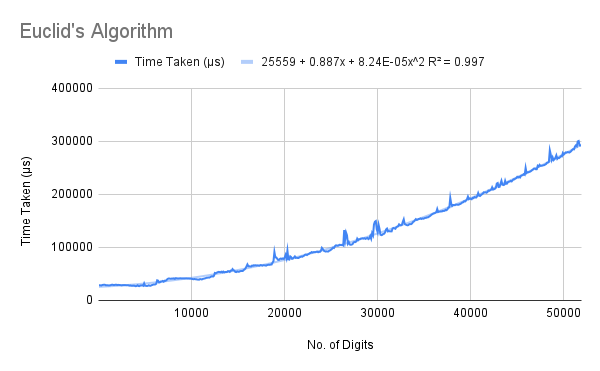
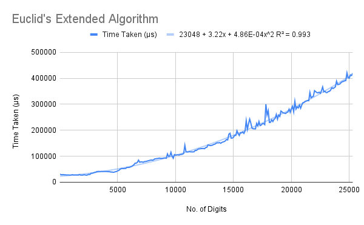
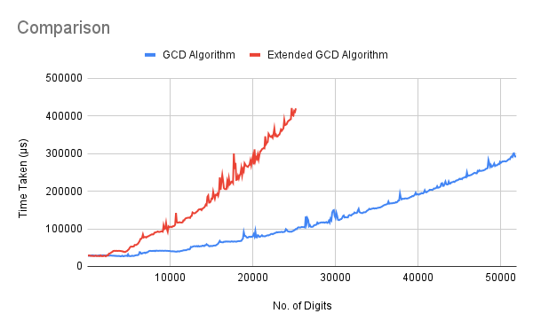

# Euclid's Algorithm
Euclid's Algorithm for computing the greatest common divisor of two numbers, along with the extended version to find the coefficients, were both taught. The former is defined in the `GHC.Real` module, which is automatically imported; its source is in the file also, but is commented out. The complete module can be seen [here](https://hackage.haskell.org/package/base-4.16.0.0/docs/GHC-Real.html). It follows the same recursion taught in class.  

The latter is defined recursively, also as taught in class.

## Running
To run one of the algorithms, uncomment (remove the two hyphens and the space preceding) the corresponding line in the `main` function, save the file, and recompile. When running, pass *a* and *b* as command-line arguments.
```
> ./euclid 35 28
> (1,-1,7)
```

## Explanation
### GCD Algorithm
This function, taken from the default `GHC.Real` module, first finds the absolute value of its arguments and then carries out the recursion using the `rem` (remainder) function.

### Extended GCD Algorithm
This function does not find the absolute value of its arguments, to avoid unnecessary overheads (as the functions are tested on positive numbers only). The recursion proceeds in exactly the way taught in class.  

It returns a triple of integers, representing the coefficients and the GCD resepectively. In other words, if `extEuc a b` returns `(x,y,d)` it means that *ax + by = d*.

## Analysis
The running times are plotted against the number of digits in each of the arguments, which are generated randomly. The number of digits ranges between 1 and 50,001 (in the GCD case) and 1 and 25,501 (in the extended case).

The R² values of the best fit of various types of functions for each of the algorithms' running times are shown below.  

Algorithm    | Linear | Quadratic | Exponential | Power Series | Logarithmic  
------------ | ------ | --------- | ----------- | ------------ | -----------  
GCD          | 0.954  | 0.997     | 0.988       | 0.705        | 0.535  
Extended GCD | 0.953  | 0.993     | 0.976       | 0.691        | 0.507  

### GCD Algorithm
The analysis carried out in class gives us a running time logarithmic in the magnitude of the arguments, and linear in the number of digits. This is the number of steps in the recursion.  
However, the `rem` function does not run in constant-time. We can see, however, that the R² values of the polynomial functions are extremely high. It is therefore likely that `rem` is linear in the number of digits.

  

### Extended GCD Algorithm
The only extra computation involved in this function is the division and subtraction, both of which depend linearly on the number of digits. Thus, here also, we have a high R² value for the quadratic best-fit curve.

  

## Comparison
We can see that although the big-O times are the same, the extended algorithm takes considerably more time (more than double). We expect that this is the overhead of the `div` and `(-)` functions (more likely the former).


