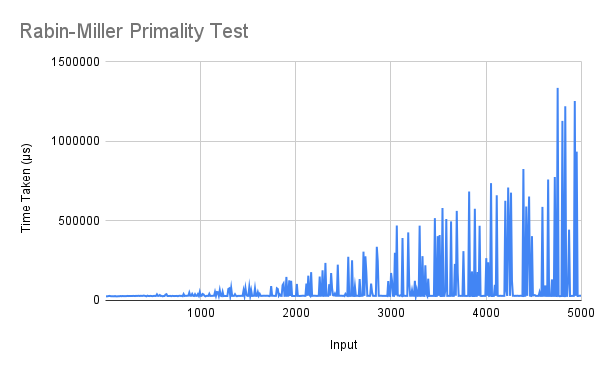

# Rabin-Miller Primality Testing Algorithm
The probabilistic Rabin-Miller algorithm for primality testing was covered in class, along with a proof of correctness and an estimation of the probability of correctness.

## Running
To run one the algorithm, uncomment (remove the two hyphens and the space preceding) the corresponding line in the `main` function, save the file, and recompile. When running, pass *k* and *p* as command-line arguments.
```
> ./rabin 7 37
> True
```

## Explanation
The `isPrime` function determines if its second argument `p` is likely to be prime or not. First, it checks if `p` is odd or even, and if it is even, only 2 is accepted.  

If `p` is odd, first the `k` random numbers are chosen and stored in the list `a`. The `getRnd` function returns `k` randomly (but not uniformly) chosen numbers out of a list `zp` of `l` numbers, by traversing the list, and deciding whether or not to include the current element, until `k` are found.  

The `mkStdGen` function creates a generator from an integer seed (2021 in the code, but it could be anything). The generator is passed to `getRnd`, and every subsequent call of `getRnd` uses a new generator created from the old one. In fact, since the seed is constant, this procedure yields a deterministic set of numbers, but changing the seed to a random value is sufficient to alter this. Note that true randomness (or even pseudorandomness) brings impurity into the code, as it violates referential transparency.  

Then, `s` and `t` are determined from `p-1`. These are the preliminary computations.  

Now, the list comprehension iterates over all elements of `a`, and carries out the tests on each of them. It fills a list with boolean values, according as each element of `a` is a witness or a nonwitness. The `and` function then returns `True` only if all elements are true.

## Analysis
The function was tested on every 10th number starting from 1 as `p`, and `k` chosen randomly between 1 and `p`.  

The R² values of the best fit of various types of functions for each of the algorithms' running times are shown below.  

Linear | Quadratic | Exponential | Power Series | Logarithmic  
------ | --------- | ----------- | ------------ | -----------  
0.102  | 0.113     | -0.7        | 0.074        | 0.056  

The irregularity of the running time means that it is, however, impossible to draw any conclusions from the best-fit line. Therefore it is not considered in the graph.  

We can analyse the code to find the expected running time in terms of *k* and *p*.  

First, let us see the time for `getRnd`. It passes over `[1..p-1]`, deciding whether or not to include each element randomly, until it has found `k` elements. This will run an average of 2`k` times. Since `k` is on average half of `p`, this adds time proportional to `p`.  

Then, `s` and `t` are calculated. Calculating `s` takes time linear in the power of 2 present in `p-1`, which varies from 0 to 5000. However, this function does not have a closed form; we will consider this as constant time.  

Now, for each `i` from 0 to `k`-1, first the powers `pows` are calculated. This requires indexing into `a` (time proportional to `k`) and taking the power and the modulus.  
This list `pows` is then traversed by `all` and `takeWhile` and `last`, which adds a factor proportional to log *t*. We have taken this as constant.  

Therefore we have a total time of O(*p* + *k*²), which reduces to O(*p*²).


