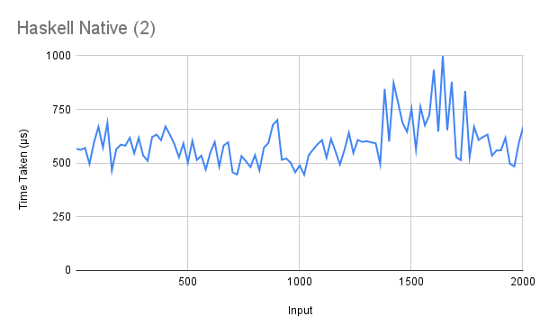
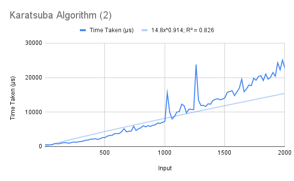

# Algorithms to Multiply Integers
Two algorithms were taught in class to multiply arbitrary-size integers:

1. the naïve school algorithm  
2. the Karatsuba algorithm  

In addition to these two, Haskell's native multiplication operator `*` is also given for comparison.  

During implementation, two possible representations of arbitrary-size integers were considered – a list of digits (from highest power to smallest), or the normal representation. The school algorithm was more convenient in the former representation, while the Karatsuba algorithm and Haskell's multiplication operator could be more easily applied to the latter. Therefore all three operators were implemented in both representations.  

Note: Haskell's arbitrary-size integer type, `Integer`, is the input and return type of all the functions in the second representation.

## Running
To run one of the algorithms, uncomment (remove the two hyphens and the space preceding) the corresponding line in the `main` function, save the file, and recompile. When running, pass the operands as command-line arguments (in quotes in case they are lists).
```
> ./multiplication 123 456
> 56088
> ./multiplication "[1,2,3]" "[4,5,6]"
> "[5,6,0,8,8]"
```

## Explanation
### The School Algorithm
This solution runs in quadratic time, by computing partial products of one operand with each digit of the other, shifting each by the required amount, and adding. In the list representation, the shifting is done by appending a zero to the beginning prior to adding. For example, consider the input `[1,2,3]` times `[4,5,6]`. The list `t` has the value `[[4,8,12,0,0],[5,10,15,0,0],[6,12,18,0,0]]` (note that single-digit multiplication is done using the native operator, as a base case).  
This list is folded from the right (`foldr`) with the function `\b p -> zipWith (+) b (0:p)` and the base case `[0,0,..]` (which is the same as `repeat 0`). Thus the sequence of operations is:  
`zipWith (+) [6,12,18,0,0] (0:[0,0,..])         = [6,12,18,0,0]`  
`zipWith (+) [5,10,15,0,0] (0:[6,12,18,0,0,0])  = [5,16,27,18,0]`  
`zipWith (+) [4,8,12,0,0]  (0:[5,16,27,18,0,0]) = [4,13,28,27,18]`  

The `toNum` converts this list to one with only single digits as elements, by taking `mod 10` and adding the carry-overs.  

In the ordinary representation, the number is first converted to a list of digits and then back to an integer at the end.

### The Karatsuba Algorithm
This is a recursive algorithm, which runs by splitting the digits into two parts and computing the sub-products recursively. The `split` and `split2` functions divide both the integers and return a tuple of the parts, and the number of digits in the second part. The submultiplications take place and the products are multiplied by the appropriate power of 10, before being added together.  
The base case is when *either* of the arguments has a single digit. It is carried out using the ordinary multiplication operator.  

In the list representation, the base case is given by multiplying the digit and applying `toNum`. Further, multiplication by the powers of 10 is carried out by appending the required number of 0s to the end. `plus` and `minus` are for adding and subtracting (respectively) two list-represented integers of *unequal* length, by first padding one of them.

## Analysis
Each of the functions was run on a (different) randomly generated testcase, on numbers of lengths separated by intervals of 20 from 2 to 2002.  
The list representation's graphs are marked as (1) and the normal representation's as (2).
The R² values of the best fit of various types of functions for each of the algorithms' running times are shown below.  

Algorithm          | Linear | Quadratic | Exponential | Power Series | Logarithmic  
------------------ | ------ | --------- | ----------- | ------------ | -----------  
Haskell Native (1) | 0.407  | 0.408     | 0.404       | 0.298        | 0.279  
Haskell Native (2) | 0.091  | 0.101     | 0.086       | 0.032        | 0.038  
School (1)         | 0.709  | 0.794     | 0.796       | 0.823        | 0.373  
School (2)         | 0.895  | 0.975     | 0.958       | 0.797        | 0.473  
Karatsuba (1)      | 0.704  | 0.704     | 0.634       | 0.839        | 0.487  
Karatsuba (2)      | 0.928  | 0.949     | 0.907       | 0.826        | 0.55  

Best fit curves are not considered for the first two methods as their values show that the trendline is not accurate for any standard type of function.  

### Haskell Native
This operation is extremely efficient, which is probably why we cannot see a significant trend in its running times in the small range. The graph is dominated by noise.  

However, one conclusion we *can* draw would be the conversion time from the list representation to the ordinary representation (and back), which takes place in the first implementation. The average time of this (across all input lengths) is 707 μs in the list representation and 595 μs in the normal representation, which tells us that it takes about 100 μs (or 0.0001 seconds) to carry out the conversion.  
While this offset is significant in this efficient operation, it is entirely negligible in the school algorithm's running time, and rapidly becomes so in the Karatsuba algorithm's.

  

  


### The School Algorithm
This algorithm grows very fast compared to both others. As noted above, however, the conversion time between representations (which we expect to be disadvantageous to the normal representation) makes very little difference.  

In fact, the average time of the normal representation is much better – 16600 μs, as compared to 23726 μs for the list representation. This can be attributed to the high amount of fluctuation noted in the graph, although the reason for this is unknown. The two implementations are identical, except for the conversion layered on the second one.  

Notably, the range of 0- to 2000-digit numbers is enough to show the quadratic running time. The best-fit equation in both cases is quadratic, and its leading coefficient is not a negligible value (usually higher-order polynomial best fit equations tend to have leading coefficients of the order of 10^-5). The high R² value in the case of the normal representation is also encouraging.

  

  

### The Karatsuba Algorithm
This is an efficient divide-and-conquer solution. This is illustrated in its runtime, which stays under 0.03 seconds (not considering irregular spikes and fluctuations).  

The best-fit power series lines, remarkably, do not have the best R² values among all types of functions. Furthermore, they do not match up with the expected complexity (approximately n^1.585). This could be because of the small range of inputs.

  

  

## Comparisons
Two comparisons can be done – of the list-based methods among themselves and of the integer-based methods among themselves.  

The list-based methods' comparisons are mostly as expected. The native `(*)` operator is almost constant compared to the other two methods, between which the Karatsuba algorithm is consistently better (even though the list representation is a poorer choice for it as compared to the school method).  

  

  

The integer-based methods' comparison follows much the same pattern.  

  

  

It can also be seen that the integer-based methods, although they usually take less time, are significantly less irregular than the list-based implementations. The reason for this observation is not clear either.  

  

  
